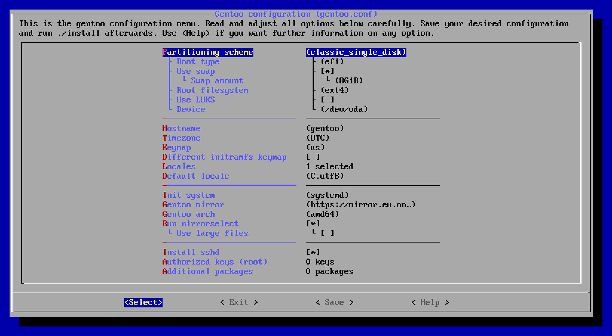

## About gentoo-install

This is an installer for gentoo with a simple configuration TUI inspired by menuconfig.
The configurator is only used to generate a `gentoo.conf` file, which can also be
edited by hand, or reused later if desired. An example configuration is provided with the repository.

The installer supports the most common disk layouts, different file systems like ext4, ZFS and btrfs as well
as additional layers such as LUKS or mdraid. It also supports both EFI (recommended) and BIOS boot,
and can be used with systemd or OpenRC as the init system.

## Quick start

First, boot into a live environment of your choice. I recommend using an [Arch Linux](https://www.archlinux.org/download/) live iso,
as the installer will then be able to automatically download required programs or setup zfs support on the fly. After that,
proceed with the following steps:

1. Either clone this repo or download and extract a copy
1. Run `./configure` and save your desired configuration
1. Begin installation using `./install`

Every option is explained in detail in `gentoo.conf.example` and in the help menu popups in the configurator.
When installing, you will be asked to review the partitioning before anything critical is done.

## Overview

The system will use `sys-kernel/gentoo-kernel-bin`, which should be suitable
to boot most systems out of the box. It is strongly recommend to replace this kernel
with a custom built one, when the system is functional.

The installer should be able to run without any user supervision after partitioning, but depending
on the current state of the gentoo repository you might need to intervene in case a package fails
to emerge. The critical commands will ask you what to do in case of a failure.

Here is an outline of the steps that are carried out:

1. Partition disks (supports gpt, raid, luks)
1. Download and cryptographically verify the newest stage3 tarball
1. Extract the stage3 tarball
1. Sync portage tree
1. Configure portage (create zz-autounmask files, configure `make.conf`)
1. Select the fastest gentoo mirrors if desired
1. Configure the base system (timezone, keymap, locales, ...)
1. Install git and other required tools (e.g. zfs if you have used zfs)
1. Install `sys-kernel/gentoo-kernel-bin` (until you can compile your own)
1. Generate an initramfs with dracut
1. Create efibootmgr entry or install syslinux depending on whether your system uses EFI or BIOS
1. Generate fstab
1. Depending on the configuration:
   - (Optional) Install sshd with secure config
   - (Optional) Install dhcpcd (if using OpenRC)
   - (Optional) Install additional packages provided in config
1. Asks if a root password should be set

Anything else is probably out of scope for this script, but you can obviously do
what you want later on when the system is booted. Here are some things that you probably
want to consider doing after the base system installation is finished:

1. Read the news with `eselect news read`.
2. Compile a custom kernel and remove `gentoo-kernel-bin`
3. Adjust `/etc/portage/make.conf`
   - Set `CFLAGS` to `-O2 -pipe -march=native` for native builds
   - Set `CPU_FLAGS_X86` using the `cpuid2cpuflags` tool
   - Set `FEATURES="buildpkg"` if you want to build binary packages
4. Use a safe umask like `umask 0077`

If you are looking for a way to detect and manage your kernel configuration, have a look at [autokernel](https://github.com/oddlama/autokernel).

### (Optional) sshd

The script can provide a fully configured ssh daemon with reasonably good security settings.
It will by default only allow ed25519 keys, restrict key exchange
algorithms to a reasonable subset, disable any password based authentication,
and only allow root to login.

You can provide keys that will be written to root's `.ssh/authorized_keys` file. This will allow
you to directly continue your setup with your favourite infrastructure management software.

### (Optional) Additional packages

You can add any amount of additional packages to be installed on the target system.
These will simply be passed to a final `emerge` call before the script is done,
where autounmasking will also be done automatically. It is recommended to keep
this to a minimum, because of the quite "interactive" nature of gentoo package management ;)

## Troubleshooting and FAQ

After the initial sanity check, the script should be able to finish unattendedly.
But given the unpredictability of future gentoo versions, you might still run into issues

The script checks every command for success, so if anything fails during installation,
you will be given a proper message of what went wrong. Inside the chroot,
most commands will be executed in a checked loop, and allow you to interactively
fix problems with a shell, to retry, or to skip the command.

#### Q: I get errors after partitioning about blkid not being able to find a UUID

**A:** Use `wipefs -a <DEVICE>` on your partitions or fully wipe the disk before use.
The new partitions probably align with previously existing partitions that had
filesystems on them. Some filesystems signatures like those of ZFS can coexist with
other signatures and may cause blkid to find ambiguous information.

## References

* [Sakaki's EFI Install Guide](https://wiki.gentoo.org/wiki/Sakaki%27s_EFI_Install_Guide)
* [Gentoo AMD64 Handbook](https://wiki.gentoo.org/wiki/Handbook:AMD64)
